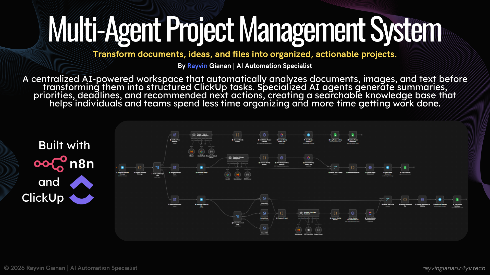

# Multi-Agent Project Management System

Automation-first, multi-agent project workflow in n8n for turning unstructured inputs into organized ClickUp tasks.




## Introduction

Multi-Agent Project Management System is a production-ready n8n workflow that automates project intake and organization.

The system receives documents, images, and plain text from Telegram, classifies input type, routes content to a specialized AI agent, extracts structured information, creates ClickUp tasks, uploads attachments, sends confirmations, and logs activity in Google Sheets.

This architecture reduces manual overhead and creates a centralized, searchable project workspace.

## Table of Contents

- [Problem](#problem)
- [Highlights](#highlights)
- [Download Workflow](#download-workflow)
- [Workflow Overview](#workflow-overview)
- [Architecture Diagram](#architecture-diagram)
- [AI Agents](#ai-agents)
- [Workflow Process](#workflow-process)
- [Example Outputs](#example-outputs)
- [Technologies](#technologies)
- [Results](#results)
- [Installation](#installation)
- [Configuration](#configuration)
- [Customization](#customization)
- [Future Improvements](#future-improvements)
- [License](#license)

## Problem

Teams and professionals receive high volumes of unstructured information every day: documents, screenshots, notes, reminders, and project ideas.

Manual processing usually requires reading, summarizing, prioritizing, assigning deadlines, creating tasks, uploading files, and updating trackers. As volume grows, this becomes repetitive and inconsistent.

Typical consequences:

- Important files are buried in chats
- Ideas are missed
- Deadlines are overlooked
- Documentation is fragmented across tools

## Highlights

- Multi-agent AI architecture with specialized responsibilities
- Intelligent routing based on content type
- Automated extraction of summaries, priorities, deadlines, and actions
- Automatic ClickUp task creation with metadata
- Attachment upload support for applicable inputs
- Telegram confirmation notifications
- Google Sheets activity logging
- Modular workflow design for extension and adaptation

## Download Workflow

Main n8n workflow file:

- [Multi-Agent Project Management System.json](Multi-Agent%20Project%20Management%20System.json)

## Workflow Overview


```text
Telegram Input
   |
   v
Content Type Detection
   |
   +--> Document --> Archivus
   +--> Image    --> Spectra
   +--> Text     --> Praetor
			   |
			   v
	  Structured Project Data
			   |
			   v
	   ClickUp Task Creation
			   |
	 +---------+---------+
	 v                   v
Telegram Notification   Google Sheets Log
```

## Architecture Diagram

```text
[Telegram]
	|
	v
[n8n Intake + Classification]
	|
	+--------------------+--------------------+
	|                    |                    |
	v                    v                    v
[Archivus]           [Spectra]           [Praetor]
 Document AI         Visual AI           Task/Project AI
	\                    |                    /
	 \                   |                   /
	  +--------- Structured Output ---------+
						  |
						  v
					[ClickUp API]
						  |
			+-------------+-------------+
			v                           v
	 [Telegram Bot API]         [Google Sheets API]
```

```text
Architecture Layers
1. Ingestion Layer: Telegram
2. Orchestration Layer: n8n routing and control flow
3. Intelligence Layer: Archivus, Spectra, Praetor
4. Delivery Layer: ClickUp task creation and attachments
5. Reporting Layer: Telegram confirmations and Sheets logs
```

## AI Agents

| Agent | Role | Primary Responsibilities |
|---|---|---|
| Archivus | Document Intelligence Agent | Analyze documents, summarize, classify, detect priority/deadline/timeframe, recommend actions, produce structured output for ClickUp |
| Spectra | Visual Intelligence Agent | Analyze screenshots and images, interpret visual context, classify content, identify actionable items, recommend actions |
| Praetor | Task and Project Intelligence Agent | Process reminders/notes/ideas, generate project titles, assign priority, detect deadlines, calculate relative due dates, structure project data |

## Workflow Process

| Step | Description |
|---|---|
| 1 | Receive documents, images, or plain text via Telegram |
| 2 | Detect content type |
| 3 | Route content to Archivus, Spectra, or Praetor |
| 4 | Agent analyzes the input |
| 5 | Generate structured fields (summary, category, priority, deadline, timeframe, recommended action) |
| 6 | Create a ClickUp task |
| 7 | Upload original attachment when applicable |
| 8 | Send Telegram confirmation |
| 9 | Log processing details to Google Sheets |
| 10 | Update project dashboard for text-based project requests |

## Example Outputs

### Input Examples

| Type | Example |
|---|---|
| Document |  |
| Image |  |
| Text |  |

### System Outputs

| Destination | Example |
|---|---|
| ClickUp Task |  |
| Telegram Notification |  |
| Google Sheets Log |  |

## Technologies

| Category | Stack |
|---|---|
| Automation | n8n |
| AI Providers | Google Gemini, Mistral AI, GPT OSS |
| Project Management | ClickUp |
| Messaging | Telegram Bot API |
| Data Logging | Google Sheets |
| APIs | ClickUp API, Telegram API, HTTP Request |
| n8n Components | AI Agent Nodes, JavaScript Code Nodes, Switch Nodes, Merge Nodes, Binary Processing, JSON Parsing, HTTP Request Nodes |

## Results

| Dimension | Manual Processing | Automated Workflow |
|---|---|---|
| Typical time per item | 7 to 15 minutes | 15 to 45 seconds |
| Steps performed | Read, summarize, prioritize, create task, upload file, update tracker | Ingest, classify, route, extract fields, create task, notify, log |
| Consistency | Varies by person and workload | Structured and repeatable |
| Retrieval quality | Often scattered across tools/chats | Centralized in ClickUp with logs |
| Estimated savings | N/A | 6 to 14 minutes per item |

Estimated impact:

- Around one hour saved every 5 to 10 processed items
- Several hours saved per week for recurring project intake

## Installation

```bash
# 1) Clone the repository
git clone https://github.com/rayvin04/Multi-Agent-Project-Management-System-n8n-AI-Workflow.git
cd Multi-Agent-Project-Management-System-n8n-AI-Workflow

# 2) Open your n8n instance
# 3) Import Multi-Agent Project Management System.json
# 4) Configure credentials and IDs (see Configuration section)
# 5) Enable and test the workflow using Telegram inputs
```

## Configuration

```text
Required credentials and IDs:

- Telegram Bot Token
- ClickUp credentials
- ClickUp Workspace ID
- Space ID
- Folder ID
- List ID
- ClickUp Custom Field IDs
- Google Sheets credentials
- AI provider credentials (Gemini, Mistral AI, GPT OSS)
- HTTP authentication where required
```

## Customization

- Update agent prompts to match your naming conventions and project taxonomy
- Adjust ClickUp fields, statuses, and priorities to fit your workflow model
- Replace Telegram intake with alternative channels (Slack, Discord, WhatsApp, Gmail, forms, webhooks, APIs) if needed
- Extend routing logic for additional content categories
- Add downstream integrations for reporting and analytics

## Future Improvements

- Google Drive integration
- Notion integration
- Slack support
- Discord support
- Email ingestion
- OCR improvements
- Additional AI agents
- Expanded project analytics
- Enhanced dashboard reporting
- Voice note processing

## License

This repository is shared for learning, inspiration, and customization.

You can adapt the workflow to your own productivity system and project management process.
